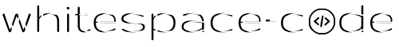

<!Header details table>
<table class="images" width="100%"  style="border:0px solid white; width:100%;">
    <tr align="center" width="100%" style="border: 0px;">
        <td style="border:0px;">
                 
        </td>
    </tr>
    <tr>
    </tr>
    <tr align="center" width="100%" style="border: 0px;">
        <td style="border:0px;">
            
        </td>
    </tr>
</table>

<!Site starts and reported issues badges>
    
    
    

<h2 style="color: black">
    About    
</h2>
<body>
    <b>Aspiring Software Developer and Data Analyst</b> 
    
            
        An enthusiastic, ambitious and dedicated manager, with over 20 years' professional
        experience in instrumentation. looking to transition into a Software Development, Data
        Analyst role.
         
        Core competencies include:
        <ul>
            <li> high level troubleshooting skills </li>
            <li> ability to motivate others</li>
            <li> commitment to continuous improvement </li>
            <li> excellent communication skills </li>
        </ul>
    

</body>

## &#8987;Current Projects
- <b>Advent of Code Challenges</b> 

 <!This section is purely for the badges each line is a new one>
    
     

    Daily data analysis challenges executed over the christmas period 
  

- <b>Blackjack</b> 

 <!This section is purely for the badges each line is a new one>
    
     

    Basic game of blackjack created as part of a training session.
    - Currently working on creating a graphical interface.
    
    

